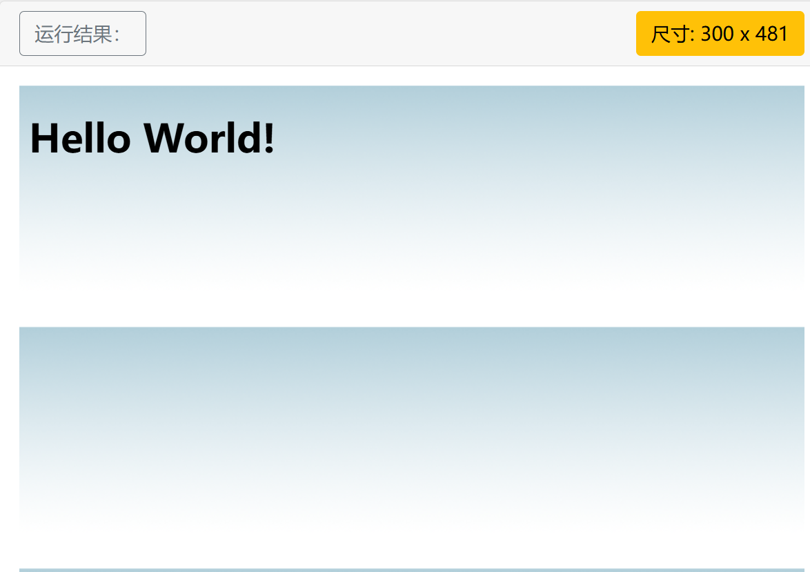

# front_study

[CSS属性表](#css属性表)

## 速查文档
### HTML 基本文档
```html
<!DOCTYPE html>
<html>
<head>
<title>文档标题</title>
</head>
<body>
可见文本...
</body>
</html>
```
### 基本标签（Basic Tags）
```html
<h1>最大的标题</h1>
<h2> . . . </h2>
<h3> . . . </h3>
<h4> . . . </h4>
<h5> . . . </h5>
<h6>最小的标题</h6>

<p>这是一个段落。</p>
<br> （换行）
<hr> （水平线）
<!-- 这是注释 -->
```
### 文本格式化（Formatting）
```html
<b>粗体文本</b>
<code>计算机代码</code>
<em>强调文本</em>
<i>斜体文本</i>
<kbd>键盘输入</kbd> 
<pre>预格式化文本</pre>
<small>更小的文本</small>
<strong>重要的文本</strong>
 
<abbr> （缩写）
<address> （联系信息）
<bdo> （文字方向）
<blockquote> （从另一个源引用的部分）
<cite> （工作的名称）
<del> （删除的文本）
<ins> （插入的文本）
<sub> （下标文本）
<sup> （上标文本）
```
### 链接（Links）
```html
普通的链接：<a href="http://www.example.com/">链接文本</a>
图像链接： <a href="http://www.example.com/"></a>
邮件链接： <a href="mailto:webmaster@example.com">发送e-mail</a>
书签：
<a id="tips">提示部分</a>
<a href="#tips">跳到提示部分</a>
图片（Images）

```
### 样式/区块（Styles/Sections）
```html
<style type="text/css">
h1 {color:red;}
p {color:blue;}
</style>
<div>文档中的块级元素</div>
<span>文档中的内联元素</span>
```
### 无序列表
```html
<ul>
    <li>项目</li>
    <li>项目</li>
</ul>
```
### 有序列表
```html
<ol>
    <li>第一项</li>
    <li>第二项</li>
</ol>
```
### 定义列表
```html
<dl>
  <dt>项目 1</dt>
    <dd>描述项目 1</dd>
  <dt>项目 2</dt>
    <dd>描述项目 2</dd>
</dl>
```
### 表格（Tables）
```html
<table border="1">
  <tr>
    <th>表格标题</th>
    <th>表格标题</th>
  </tr>
  <tr>
    <td>表格数据</td>
    <td>表格数据</td>
  </tr>
</table>
```
### 框架（Iframe）
```html
<iframe src="demo_iframe.htm"></iframe>
```
### 表单（Forms）
```html
<form action="demo_form.php" method="post/get">
<input type="text" name="email" size="40" maxlength="50">
<input type="password">
<input type="checkbox" checked="checked">
<input type="radio" checked="checked">
<input type="submit" value="Send">
<input type="reset">
<input type="hidden">
<select>
<option>苹果</option>
<option selected="selected">香蕉</option>
<option>樱桃</option>
</select>
<textarea name="comment" rows="60" cols="20"></textarea>
 
</form>
```
### 实体（Entities）
```html
&lt; 等同于 <
&gt; 等同于 >
&#169; 等同于 ©
```


## CSS属性表

### id和class选择器
1. id选择器可以为有id属性的进行设置其属性。
注意这个不能重名 ->[实例](#id索引)
2. class可以重名，用.进行索引 ->[实例](#class索引)

也可以使用元素名进行索引，如p。
### 多重样式优先级
内联样式>内部样式>外部样式>浏览器默认样式

### 背景设置
1. background-color 定义元素背景颜色
2. background-image 定义元素背景图像,背景图像时平铺展示，覆盖整个元素实体 ->[实例](#定义元素背景图像)
3. background-repeat 设置元素只在特定方向上平铺。
repeat-x:x方向上重复
repeat-y:y方向上重复
no-repeat:表示都不重复
4. background-position 设置图片位置
- 可以设置两个参数，如right top,代表坐标xy
5. background-attachment 设置背景图像是否固定或者虽页面的其余部分滚动。
- scroll 随页面滚动而滚动
- fixed 背景图片不会随着页面的滚动而滚动
- local 随着元素内容的滚动而滚动
- initial 默认值
- inherit 制定其设置从父元素继承
6. background-blend-mode设置背景叠加模式，有正片叠底一类的，主要和ps中的叠加方式很像。
### 文本格式
1. color 设置颜色
2. text-align 设置对其方式
- center 居中，right，left
- justify 每一行被展开为宽度相等，左右外边距是对齐的。
3. text-decoration 设置或删除文本装饰
主要用来删除链接的下划线 ->[实例](#设置文本装饰)
也可以给文本设置上面划线，下划线和划除线
4. text-transform 转换文本大小写
- uppercase 转大写
- lowercase 转小写
- capitalize 首字母大写
5. text-indent 文本缩进，用px表示

| 属性                                                         | 描述                     |
| :----------------------------------------------------------- | :----------------------- |
| [color](https://www.runoob.com/cssref/pr-text-color.html)    | 设置文本颜色             |
| [direction](https://www.runoob.com/cssref/pr-text-direction.html) | 设置文本方向。           |
| [letter-spacing](https://www.runoob.com/cssref/pr-text-letter-spacing.html) | 设置字符间距             |
| [line-height](https://www.runoob.com/cssref/pr-dim-line-height.html) | 设置行高                 |
| [text-align](https://www.runoob.com/cssref/pr-text-text-align.html) | 对齐元素中的文本         |
| [text-decoration](https://www.runoob.com/cssref/pr-text-text-decoration.html) | 向文本添加修饰           |
| [text-indent](https://www.runoob.com/cssref/pr-text-text-indent.html) | 缩进元素中文本的首行     |
| [text-shadow](https://www.runoob.com/cssref/css3-pr-text-shadow.html) | 设置文本阴影             |
| [text-transform](https://www.runoob.com/cssref/pr-text-text-transform.html) | 控制元素中的字母         |
| [unicode-bidi](https://www.runoob.com/cssref/pr-text-unicode-bidi.html) | 设置或返回文本是否被重写 |
| [vertical-align](https://www.runoob.com/cssref/pr-pos-vertical-align.html) | 设置元素的垂直对齐       |
| [white-space](https://www.runoob.com/cssref/pr-text-white-space.html) | 设置元素中空白的处理方式 |
| [word-spacing](https://www.runoob.com/cssref/pr-text-word-spacing.html) | 设置字间距               |
### 链接样式


## 实例处

### id索引
```css
#para1{
  text-align:center;
  color:red;
}
```
### class索引
```css
.center{text-align:center;
}
```
### 定义元素背景图像
```css
body{
  background-image:url('paper.gif');
}
```

### 设置特定方向平铺
```css
body{
  background-image:url('paper.gif');
  background-repeat:repeat-x;
}
```
设置效果
 

### 设置文本装饰